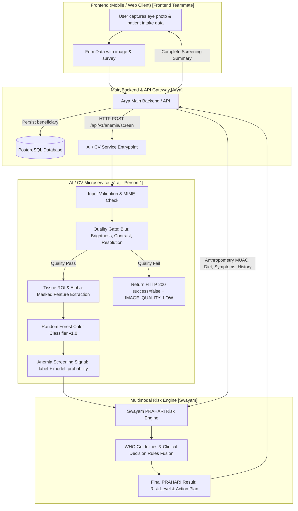

# PRAHARI System Architecture & Data Flow

**Hackathon Architecture — End-to-End Multimodal Anemia & Malnutrition Screening Platform**

---

## 1. Team Ownership & Responsibilities

```
+--------------------------------------------------------------------------------+
|                             PRAHARI TEAM ROLES                                 |
+----------------------+--------------------+-----------------+------------------+
| Sidhan    | Arya               | Viraj (Person 1)| Swayam           |
| UI / Mobile App      | Backend / Database | AI / CV Service | Risk Engine      |
+----------------------+--------------------+-----------------+------------------+
```

| Role / Domain | Owner | Key Responsibilities |
|---|---|---|
| **UI / Client Application** | **Frontend Teammate** | Mobile/Web camera interface, image capture guidance, patient intake forms, interactive screening report display. |
| **Main Backend & Database** | **Arya** | Central API gateway, PostgreSQL database, beneficiary records, session persistence, audit logging, auth. |
| **AI / Computer Vision** | **Viraj (Person 1)** | Image quality gate, tissue feature extraction (RGB/LAB/HSV), Random Forest screening inference, standalone FastAPI service. |
| **Multimodal Risk Engine** | **Swayam** | Fusion of AI screening signal + anthropometry (MUAC) + diet recall + symptoms + history -> Final PRAHARI Risk Score & referral. |

---

## 2. End-to-End Data Flow



---

## 3. Detailed Data Flow Description

```
Frontend (UI)
   ↓ (Multipart FormData: image + patient data)
Arya / Main Backend
   ↓ (HTTP POST /api/v1/anemia/screen with image bytes)
AI Service (Viraj)
   ↓
Quality Gate (checks brightness, contrast, sharpness, resolution)
   ↓
ROI / Features (alpha-masked palpebral conjunctiva color features: 19 features in RGB/LAB/HSV)
   ↓
Random Forest Primary Model (random_forest_color_baseline v1.0)
   ↓
Anemia Screening Signal (prediction.label + prediction.model_probability)
   ↓
Swayam Risk Engine (fuses AI signal + MUAC + diet + clinical symptoms + history)
   ↓
Final PRAHARI Result (Risk Tier: High/Medium/Low + Action Plan / Referral)
```

---

## 4. Component Boundaries & Isolation Guarantees

1. **AI Service Independence:**
   - The AI service operates as an autonomous microservice on port 8000.
   - It maintains zero dependency on PostgreSQL, user authentication, or mobile UI frameworks.
   - It performs one task with high reliability: validating image quality and predicting conjunctival anemia signal.

2. **Decoupled Risk Calculation:**
   - The AI service does **not** compute final patient risk, does not predict hemoglobin g/dL, and does not prescribe treatments.
   - Swayam's engine remains the single source of truth for clinical triage logic and multi-factor fusion.

3. **Arya Backend Decoupling:**
   - Arya's backend does not embed or execute machine learning inference pipelines locally; it communicates with the AI service over lightweight HTTP REST.
