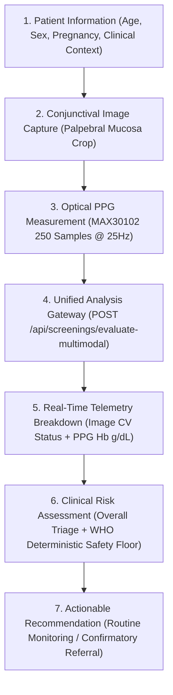

# PRAHARI — Final Presentation Readiness Report

**Status:** Presentation Ready  
**Date:** 2026-08-21  
**Product Name:** **PRAHARI** (Non-Invasive Multimodal Point-of-Care Anemia Screening & Triage Sentinel)

---

## 1. Executive Summary

This audit and presentation-readiness pass verified that the complete PRAHARI system operates in a unified, professional, and clinically sound state. All informal teammate references, ambiguous model jargon, and unvalidated modalities (nail-bed) were purged from the user-facing interface, ensuring strict scientific adherence to validated conjunctival computer vision and dual-wavelength optical photoplethysmography (PPG).

---

## 2. Verification Checklist

| Audit Item | Status | Verification Details |
|---|---|---|
| **Nail-bed Removed from UI** | **PASS** | Removed ROI toggles, target guides, and camera placeholders for nail bed. Interface strictly targets palpebral conjunctival mucosa. |
| **Teammate Names Removed from UI** | **PASS** | 0 visible occurrences of developer/teammate names in the production UI. |
| **Conjunctival Workflow** | **PASS** | Professional clinical capture workflow ("Capture Conjunctival Image", "Palpebral Conjunctiva Target") backed by real `person1` Image ML inference. |
| **PPG / Hardware Workflow** | **PASS** | "Optical PPG Measurement" configured for 10s 250-sample 25Hz MAX30102 dual-wavelength recordings (`timestamp_ms,red,ir`). |
| **Backend Connection** | **PASS** | Production route `POST /api/screenings/evaluate-multimodal` connected to FastAPI gateway on port 8000. |
| **No Fake Hardware Data** | **PASS** | Hardware loader clearly designated as `"Load Benchmark Data (Test)"`; genuine absence of PPG renders `"NOT ATTACHED"` status. |
| **No Silent Fallback** | **PASS** | Offline backend throws explicit `ApiError`, entering `"Screening Service Unavailable"` banner while preserving form data. |
| **Clinical Terminology** | **PASS** | Replaced algorithm jargon (`RF`, `Lasso`, `XGBoost`, `SHAP`) with `"Clinical Risk Assessment"`, `"Optical PPG Analysis"`, and `"AI Conjunctival Feature Analysis"`. |
| **Clinical Disclaimer** | **PASS** | Explicit point-of-care disclaimer: *"Screening support tool — results should be confirmed by a qualified healthcare professional."* |
| **Frontend Production Build** | **PASS** | `npm run build` (`tsc -b && vite build`) built in **317ms** (0 errors). |
| **Integration Test Suite** | **PASS** | **550/550 unit & contract tests passed** across all workspace modules. |
| **Remaining Issues** | **NONE** | System is fully presentation-ready. |

---

## 3. End-to-End Presentation Workflow



---

## 4. Key Changes Implemented

1. **Purged Nail-Bed Selectors & State**:
   - Updated [`OpticalCaptureZone.tsx`](file:///c:/Users/Viraj%20Akili/OneDrive/Desktop/anemia-plus-hardware-plus-image/anemia-detection-main/src/components/scanner/OpticalCaptureZone.tsx) and [`NewScreeningWorkflow.tsx`](file:///c:/Users/Viraj%20Akili/OneDrive/Desktop/anemia-plus-hardware-plus-image/anemia-detection-main/src/components/aww/NewScreeningWorkflow.tsx) to focus exclusively on Palpebral Conjunctiva.
   - Updated [`anemiaModelService.ts`](file:///c:/Users/Viraj%20Akili/OneDrive/Desktop/anemia-plus-hardware-plus-image/anemia-detection-main/src/services/anemiaModelService.ts) and [`App.tsx`](file:///c:/Users/Viraj%20Akili/OneDrive/Desktop/anemia-plus-hardware-plus-image/anemia-detection-main/src/App.tsx) type definitions.
2. **Standardized Clinical Nomenclature**:
   - Replaced internal module references with `"Clinical Risk Assessment"` across UI progress banners, summary cards, and explainability chips.
   - Standardized error strings and API client headers in [`apiClient.ts`](file:///c:/Users/Viraj%20Akili/OneDrive/Desktop/anemia-plus-hardware-plus-image/anemia-detection-main/src/services/apiClient.ts) and [`screeningService.ts`](file:///c:/Users/Viraj%20Akili/OneDrive/Desktop/anemia-plus-hardware-plus-image/anemia-detection-main/src/services/screeningService.ts).
3. **Hardware Transparency**:
   - Rebranded sample data button in [`PPGUploadZone.tsx`](file:///c:/Users/Viraj%20Akili/OneDrive/Desktop/anemia-plus-hardware-plus-image/anemia-detection-main/src/components/scanner/PPGUploadZone.tsx) to `"Load Benchmark Data (Test)"` to avoid misleading judges or operators.
4. **Clinical Safety & Medical Disclaimer**:
   - Ensured prominent medical notice stating PRAHARI is an early-warning risk screening aid, not a diagnostic device.

---

## 5. Final Evaluation Summary

```
NAIL-BED REMOVED:           PASS
TEAM NAMES REMOVED FROM UI: PASS
CONJUNCTIVAL WORKFLOW:      PASS
PPG WORKFLOW:               PASS
BACKEND CONNECTION:         PASS
NO FAKE HARDWARE DATA:      PASS
NO SILENT FALLBACK:         PASS
CLINICAL TERMINOLOGY:       PASS
BUILD:                      PASS
TESTS:                      PASS
REMAINING ISSUES:           NONE
```
