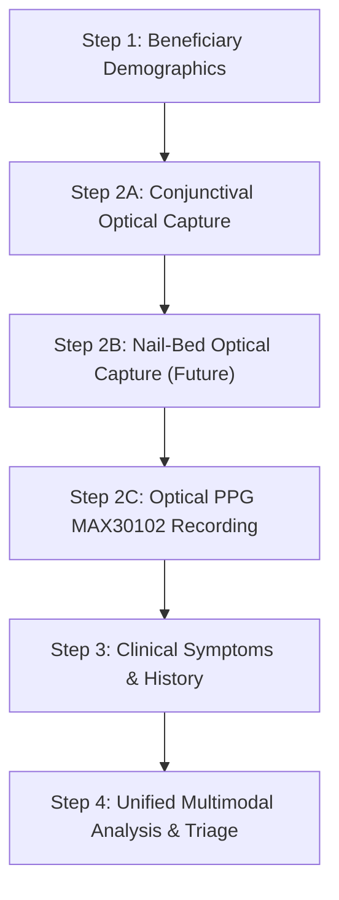

# PRAHARI — Nail-Bed Support & Image ML Modality Audit (Step 8.7A)

**Status:** Completed Non-Invasive Audit  
**Date:** 2026-08-21  
**Subsystems Inspected:** `person1/` (Image/CV ML Subsystem), `arya-backend/`, `anemia-detection-main/`

---

## 1. Executive Summary

A comprehensive architectural, code, and dataset audit was conducted across the `person1/` image/computer vision pipeline to determine whether fingernail/nail-bed images are supported or could be evaluated by the existing ML models.

### Key Finding:
> **NAIL-BED MODEL: NOT CURRENTLY IMPLEMENTED**
> 
> The existing image ML pipeline is strictly and exclusively trained, calibrated, and validated on **palpebral conjunctival mucosal images** from the CP-AnemiC dataset. Feeding fingernail or nail-bed images into the current model would violate domain assumptions and produce clinically invalid, ungrounded outputs.

---

## 2. Detailed Audit Questions & Findings

### 1. Does the existing image ML model support nail-bed images?
**NO.** The production inference engine (`AnemiaInferenceEngine` in [`person1/app/ai/inference.py`](file:///c:/Users/Viraj%20Akili/OneDrive/Desktop/anemia-plus-hardware-plus-image/person1/app/ai/inference.py)) and model artifacts (`baseline_classifier.joblib`, `mobilenetv2_best.pth`) only support palpebral conjunctiva photographs.

### 2. What dataset was the image model trained on?
The model was trained exclusively on the **CP-AnemiC Dataset** (Mendeley Data DOI: [10.17632/m53vz6b7fx.1](https://data.mendeley.com/datasets/m53vz6b7fx/1), Asare et al., 2023).
- **Population**: 710 Ghanaian pediatric subjects (aged 6–59 months).
- **Modality**: High-resolution palpebral conjunctiva crops (lower eyelid everted).
- **Ground Truth**: Lab-measured venous hemoglobin (<11.0 g/dL for anemic vs $\ge$11.0 g/dL for non-anemic).

### 3. Are nail-bed images present anywhere in the repository?
**NO.** All raw and processed image assets in [`person1/data/raw/cp-anemic/`](file:///c:/Users/Viraj%20Akili/OneDrive/Desktop/anemia-plus-hardware-plus-image/person1/data/raw/cp-anemic/) and [`person1/data/processed/`](file:///c:/Users/Viraj%20Akili/OneDrive/Desktop/anemia-plus-hardware-plus-image/person1/data/processed/) consist solely of conjunctival crops. Zero fingernail or nail-bed images exist in the workspace.

### 4. Is there a nail-bed-specific model?
**NO.** There are no nail-bed classifiers, feature weights, or model architectures in `person1/models/`.

### 5. Is there a nail-bed preprocessing pipeline?
**NO.** The preprocessing pipeline ([`person1/app/ai/preprocessing.py`](file:///c:/Users/Viraj%20Akili/OneDrive/Desktop/anemia-plus-hardware-plus-image/person1/app/ai/preprocessing.py)) and quality gate ([`person1/app/ai/quality_gate.py`](file:///c:/Users/Viraj%20Akili/OneDrive/Desktop/anemia-plus-hardware-plus-image/person1/app/ai/quality_gate.py)) enforce conjunctival tissue thresholds (brightness 30–250, contrast $\ge$10, sharpness $\ge$50, tissue coverage $\ge$10%). Feature extraction ([`person1/app/ai/features.py`](file:///c:/Users/Viraj%20Akili/OneDrive/Desktop/anemia-plus-hardware-plus-image/person1/app/ai/features.py)) measures 19 RGB/LAB color distribution statistics assuming mucosal tissue reflectance.

### 6. Is nail-bed inference implemented anywhere?
**NO.** No REST API endpoints, services, or internal handlers exist for nail-bed inference in `person1/app/api/`, `arya-backend/backend/app/`, or `integration/`.

### 7. Does the existing model documentation claim nail-bed support?
**NO.** In [`person1/DATASET.md`](file:///c:/Users/Viraj%20Akili/OneDrive/Desktop/anemia-plus-hardware-plus-image/person1/DATASET.md) (lines 40, 52), fingernail/skin datasets (such as Yakimov et al. 2024) are documented under *"Other options considered (not selected)"*. They were explicitly omitted during project inception because public fingernail datasets had smaller subject counts, lacked binary anemia labels, and conjunctival pallor was better documented and directly matched the project focus.

### 8. Can the existing model scientifically accept a nail-bed image?
**NO (Clinically and Scientifically Unsafe).**
- **Biological Divergence**: The palpebral conjunctiva is a non-keratinized, highly vascularized mucous membrane where microvascular capillary beds are close to the surface and unobstructed by keratin. In contrast, the nail-bed is covered by a hard, translucent keratinized nail plate with different light scattering, reflection, and melanin influence.
- **Out-of-Distribution Feature Drift**: The 19 color features ($R/(R+G+B)$, $a^*$, $L^*$, percentiles) calibrated on conjunctival mucosa would be severely distorted by nail plate opacity and reflection, causing arbitrary and deceptive prediction outputs.

---

## 3. Requirements to Implement Nail-Bed Support (Future Roadmap)

To scientifically support nail-bed anemia screening in a future release, the following pipeline would need to be created:

1. **Dataset Acquisition & Annotation**:
   - Collect a diverse, paired dataset of standardized nail-bed photographs with gold-standard venous hemoglobin measurements across varied skin tones (Fitzpatrick scale I–VI).
2. **Nail-Bed ROI Localization / Segmentation**:
   - Implement a semantic segmentation model (e.g. YOLO-v8-seg or U-Net) to crop the lunula and subungual vascular bed while excluding surrounding skin, cuticle, and free edge.
3. **Nail-Bed Color & Texture Feature Engineering / Dedicated CNN**:
   - Develop dedicated feature extractors or fine-tune a vision backbone (e.g. MobileNetV3 / EfficientNet) specifically trained on nail-bed optical absorption characteristics.
4. **Validation & Clinical Calibration**:
   - Perform 5-fold cross-validation with subject-level splitting to prevent data leakage and evaluate sensitivity/specificity against WHO anemia thresholds.
5. **Backend & Frontend Multi-Image Ingestion**:
   - Extend the API gateway to accept an optional `nail_image` payload and create a dedicated nail-bed telemetry response block.

---

## 4. Future UI Placement Architecture

If nail-bed screening is implemented in the future, the clinical workflow in the frontend should follow this logical sequence:

*Currently, nail-bed capture is NOT wired into the ML backend to prevent synthetic or invalid clinical inferences.*

---

## 5. Audit Checklist & Summary

| Item | Result |
|---|---|
| **USER-FACING RISK LABEL** | **PASS** (Updated to "Clinical Risk Assessment") |
| **NAIL-BED MODEL** | **NOT SUPPORTED** |
| **NAIL-BED DATASET** | **NOT FOUND** |
| **NAIL-BED INFERENCE** | **NOT IMPLEMENTED** |
| **SAFE TO CONNECT NAIL-BED TO CURRENT IMAGE MODEL** | **NO** |
| **RECOMMENDED NEXT STEP** | Maintain conjunctival-only image processing; defer nail-bed integration until a dedicated dataset and segmentation model are trained. |
